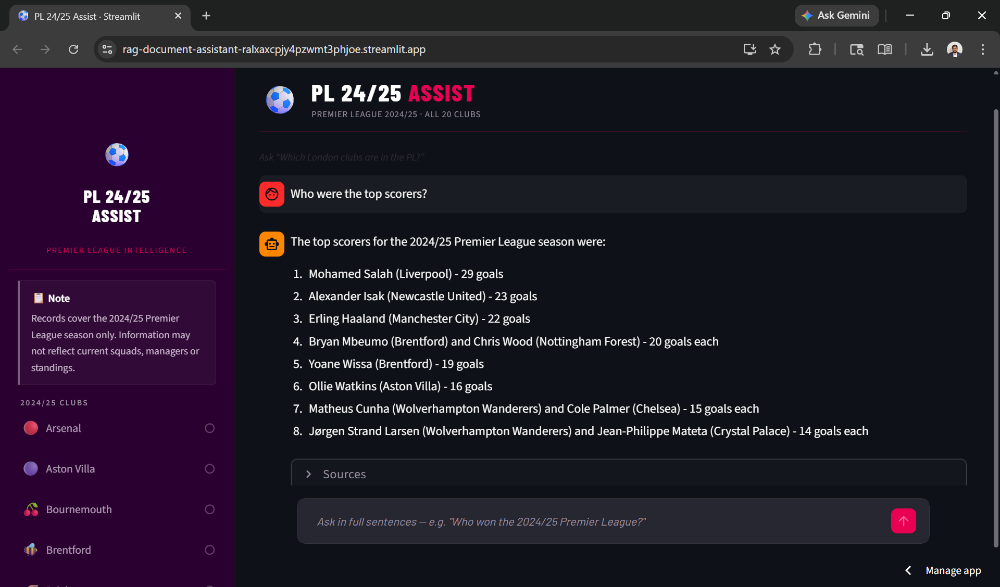

# ⚽ PL 24/25 Assist

A natural language football intelligence assistant for the **2024/25 Premier League season**, built on a retrieval-augmented generation (RAG) pipeline.

Ask anything about any of the 20 clubs or the season itself — managers, stadiums, results, records, standings — and get a direct answer with source citations.

> **Note:** This app covers the 2024/25 season only. Information may not reflect current squads, managers or standings.

---

## 🔗 Live App

[**Open PL 24/25 Assist →**](https://rag-document-assistant-ralxaxcpjy4pzwmt3phjoe.streamlit.app/)

---

## 📸 Screenshot



---

## How It Works

When you ask a question, the app:

1. Expands your query with season and club context to improve semantic matching
2. Searches a ChromaDB vector database of 21 ingested Wikipedia documents for the most relevant chunks
3. Reorders results so priority sources (PL season wiki in general mode, club wiki in club focus mode) appear first
4. For position or comparison questions, injects the standings table chunk directly into context
5. Labels each chunk as `[2024/25 Season Data]` or `[Club History]` so the model distinguishes between them
6. Passes the labelled context and conversation history to GPT-4o with a strict prompt
7. Returns a direct answer with source citations showing the document name and page number

---

## Documents

The knowledge base contains 21 Wikipedia PDFs:

- **20 club pages** — one per Premier League team (Arsenal, Aston Villa, Bournemouth, Brentford, Brighton, Chelsea, Crystal Palace, Everton, Fulham, Ipswich, Leicester, Liverpool, Man City, Man United, Newcastle, Nott'm Forest, Southampton, Tottenham, West Ham, Wolves)
- **1 season page** — the 2024/25 Premier League season wiki, covering results, standings, top scorers and managerial changes

---

## Tech Stack

| Layer | Technology |
|---|---|
| LLM | GPT-4o via `langchain-openai` |
| Embeddings | `text-embedding-3-small` |
| Vector store | ChromaDB (local, committed to repo) |
| Retrieval chain | LangChain LCEL |
| Memory | Sliding window conversation history (last 3 turns) |
| Frontend | Streamlit |
| Deployment | Streamlit Cloud |

---

## Features

- **Natural language Q&A** across 21 documents with cited sources
- **Conversation memory** — follows up on previous questions within a session
- **Club focus mode** — select any team in the sidebar to narrow retrieval and prompt context
- **Smart retrieval** — query expansion, source prioritisation and standings injection for season questions
- **Source citations** — every answer shows the document name and page number
- **Animated example questions** — CSS keyframe cycling prompts that update per club
- **Session-aware state** — chat and examples reset cleanly when switching clubs
- **Debug mode** — toggle in sidebar to inspect retrieved chunks per question
- **Custom PL-branded UI** — deep purple and pink palette, Barlow Condensed typography

---

## Project Structure

```
RAG/
├── documents/          # 21 Wikipedia PDFs (source knowledge base)
├── chroma_db/          # Persisted ChromaDB vector store
├── app.py              # Streamlit app — UI and RAG chain
├── ingest.py           # PDF ingestion script — chunks, embeds, stores
├── .env                # API keys (not committed)
├── requirements.txt    # Python dependencies
└── README.md
```

---

## Setup

### 1. Clone the repo

```bash
git clone https://github.com/YOUR_USERNAME/YOUR_REPO_NAME.git
cd YOUR_REPO_NAME
```

### 2. Install dependencies

```bash
pip install -r requirements.txt
```

### 3. Add your API key

Create a `.env` file in the project root:

```
OPENAI_API_KEY=sk-...
```

### 4. Run the app

The `chroma_db` vector store is already committed — no ingestion needed unless you change the documents.

```bash
streamlit run app.py
```

### Re-ingesting documents

If you update or replace any PDFs in the `documents/` folder, stop the app, delete the `chroma_db` folder, then run:

```bash
python ingest.py
```

---

## Deployment

Deployed on [Streamlit Cloud](https://streamlit.io/cloud):

1. Push this repo to GitHub
2. Connect to Streamlit Cloud → New app → select `app.py`
3. Add `OPENAI_API_KEY` under **Advanced settings → Secrets**
4. Deploy

The `chroma_db` folder is committed to the repo so Streamlit Cloud has the vector store immediately on deploy — no re-ingestion needed.

---

## Known Limitations

- Covers the **2024/25 season only** — does not reflect current transfers, managers or results
- Knowledge is limited to Wikipedia articles — detailed match-level stats and live data are not available
- Match-specific narratives (e.g. individual derby match reports) are not present in the Wikipedia sources
- Vague or very broad questions may retrieve less relevant chunks — specific questions work best

---

## Built With

- [LangChain](https://python.langchain.com/)
- [ChromaDB](https://www.trychroma.com/)
- [OpenAI](https://platform.openai.com/)
- [Streamlit](https://streamlit.io/)

